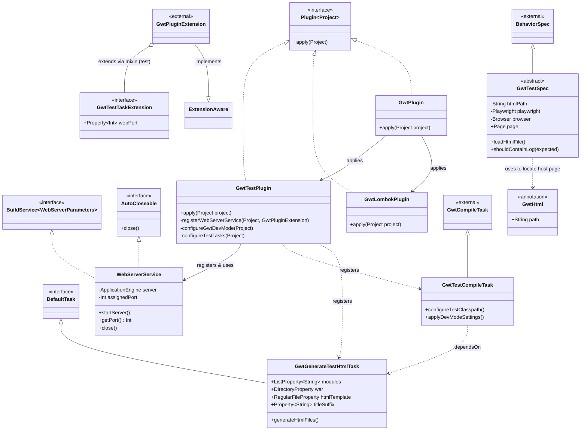

# GWT Gradle Plugin Class Diagram

이 문서는 `gwt` 프로젝트의 주요 클래스 구조와 관계를 정의합니다.

## 1. 클래스 다이어그램 (Mermaid)

## 2. 핵심 클래스 설명

### 2.1 플러그인 (Plugins)
*   **GwtPlugin**: 통합 플러그인. 내부적으로 `GwtLombokPlugin`과 `GwtTestPlugin`을 모두 적용하여 전체 기능을 활성화합니다.
*   **GwtLombokPlugin**: GWT 컴파일 시 Lombok 어노테이션이 처리된 소스코드를 사용할 수 있도록 환경을 구성합니다.
*   **GwtTestPlugin**: 테스트 환경의 핵심 플러그인. GWT 전용 컴파일 태스크와 HTML 생성 태스크를 등록하고, 웹 서버 서비스를 구성합니다.

### 2.2 태스크 및 설정 (Tasks & Extensions)
*   **GwtGenerateTestHtmlTask**: GWT 모듈을 브라우저에서 실행하기 위한 `.html` 호스트 파일을 자동 생성합니다.
*   **GwtTestCompileTask**: `GwtCompileTask`를 확장하여, 메인 소스뿐만 아니라 테스트 소스까지 포함해 GWT 컴파일을 수행합니다.
*   **GwtTestTaskExtension**: 테스트 전용 추가 설정을 정의합니다. 현재 웹 서버 포트 지정을 위한 `webPort` 속성을 제공하며, `gwt` 익스텐션의 하위 블록(`test`)으로 노출됩니다.

### 2.3 인프라 및 테스트 (Infrastructure & Testing)
*   **WebServerService**: Gradle의 `Shared Build Service`를 구현하며, Ktor 기반의 임베디드 서버를 관리합니다. 빌드 프로세스 동안 하나의 서버 인스턴스를 유지하며 테스트 리소스를 서빙합니다.
*   **GwtTestSpec**: `Kotest`의 `BehaviorSpec`을 상속받은 베이스 클래스입니다. `Playwright`를 내장하여 실제 브라우저 환경에서 GWT 코드를 검증하는 기능을 제공합니다.
*   **GwtHtml**: 테스트 클래스에 사용되는 어노테이션으로, 해당 테스트가 참조할 HTML 호스트 파일의 경로를 정의합니다.
