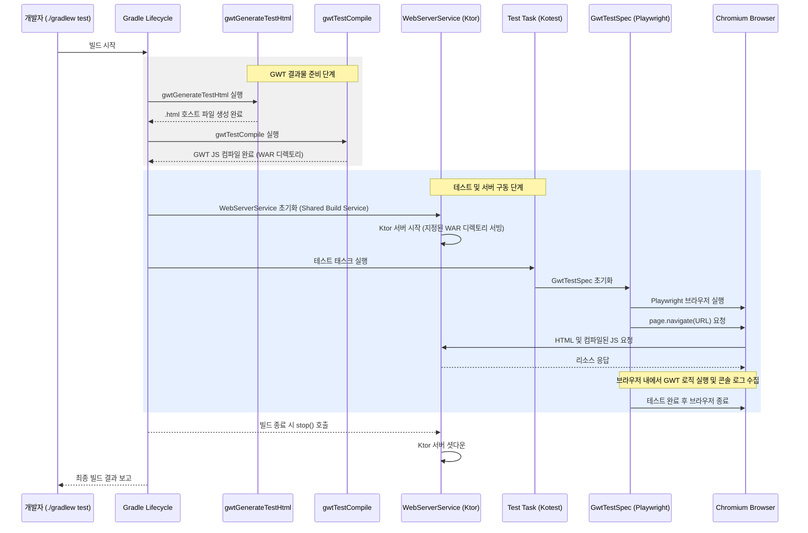

# GWT 테스트 실행 시퀀스 분석

이 문서는 Gradle 빌드 라이프사이클 내에서 GWT 테스트가 실행되는 전체 프로세스를 설명합니다.

## 1. 테스트 실행 워크플로우 (Sequence Diagram)

## 2. 주요 단계별 상세 분석

### 2.1 사전 준비 단계 (Preparation)
- **`gwtGenerateTestHtml`**: GWT 모듈을 브라우저에서 실행하기 위해 필요한 기본 HTML 구조를 자동으로 생성합니다.
- **`gwtTestCompile`**: GWT의 Java 소스 코드를 브라우저가 이해할 수 있는 JavaScript로 변환합니다. 이때 `devMode` 설정을 활용하여 컴파일 속도를 최적화합니다.

### 2.2 인프라 구성 (Infrastructure)
- **`WebServerService`**: 
    - Gradle의 `BuildService` 인터페이스를 구현하여 빌드 전체 과정에서 단 하나의 서버 인스턴스만 존재하도록 보장합니다.
    - 테스트 태스크가 여러 개라도 서버는 한 번만 뜨고 공유됩니다.
    - `contentRoot`는 GWT 컴파일 결과가 담긴 WAR 디렉토리로 설정됩니다.

### 2.3 테스트 실행 (Execution)
- **`GwtTestSpec`**: 
    - `beforeSpec` 단계에서 Playwright를 초기화하고 브라우저를 띄웁니다.
    - `GwtHtml` 어노테이션에 정의된 경로를 통해 서버의 특정 페이지로 접속합니다.
    - `page.onConsoleMessage` 리스너를 통해 브라우저 내부에서 발생하는 로그를 수집하여 Kotest의 Assertion 로직으로 전달합니다.

### 2.4 리소스 정리 (Cleanup)
- 테스트가 종료되면 `afterSpec`에서 브라우저를 닫습니다.
- 전체 Gradle 빌드가 완료되면 Gradle이 `WebServerService`의 `stop()`을 호출하여 Ktor 서버를 안전하게 종료합니다.
